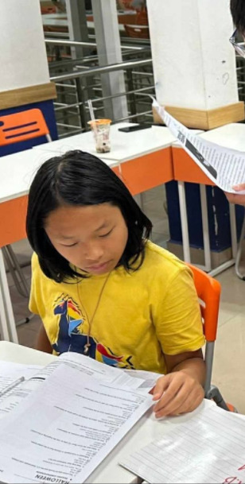

# 📘 Lê Nguyễn – The Quiet Star of the English Class

## 📌 Introduction

**"Lê Nguyễn"** is a web tribute to one of the brightest students in our English class – a calm and thoughtful boy who consistently demonstrates excellence in academics, especially in English. Known for his responsibility, sharp thinking, and humble attitude, Lê Nguyễn stands out not by volume, but by value.

This project presents a modern personal profile webpage that reflects:
- His outstanding performance in English studies.
- His dedication to learning and completing every assignment on time.
- Messages of recognition and appreciation from peers and teachers.

## 💻 Technologies Used

- Pure HTML5 + CSS3
- Responsive layout for both desktop and mobile
- Simple JavaScript to control tab-based navigation
- Image used: `le-nguyen.jpg`

## 🧠 Project Goals

- Celebrate the academic achievements of a model student.
- Encourage a culture of consistency and quiet confidence.
- Provide a reusable template to honor students in the community.

## 📷 Interface Overview

The website is structured into 3 main sections:

1. **Introduction** – Personal background and character.
2. **Academic Strength** – Highlights of his English performance and study habits.
3. **Tribute** – Words of encouragement and recognition.

## 📁 Folder Structure

~~~bash
le-nguyen/
├── index.html         # Main webpage
├── style.css          # Styling rules
├── le-nguyen.jpg      # Profile photo of Lê Nguyễn
└── README.md          # Project description
~~~

## ▶️ Visit the Website

You can view the site directly in your browser 👉 [Click here to open](https://tri1407.github.io/Le-Nguyen/)
